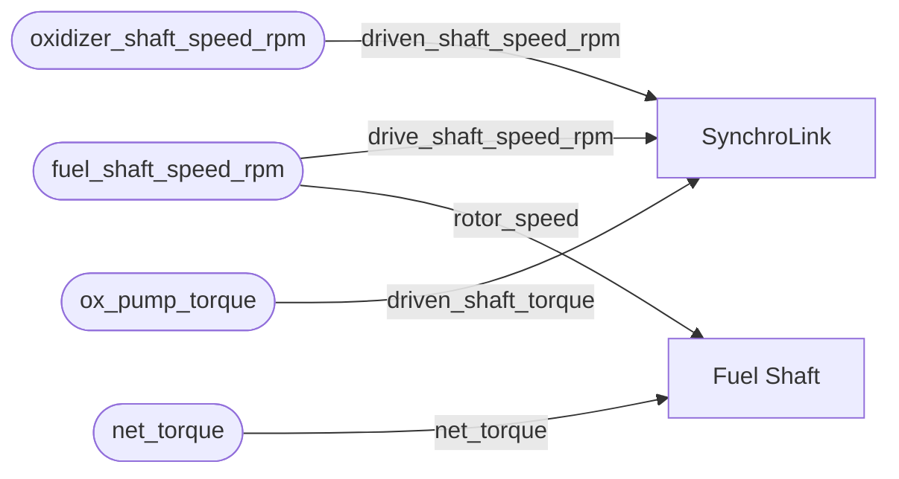

# Mark 2 cycle network - static wiring diagram

Generated by `diagram.py` from `cycle.yaml`. No solve, no CEA.

## Flow topology

```mermaid
flowchart LR
    subgraph n_Oxidizer["Oxidizer"]
        n_ox_tank(["ox_tank"])
        n_ox_pump_in(["ox_pump_in<br/>Ox Pump Inlet"])
        n_ox_pump_out(["ox_pump_out<br/>Ox Pump Discharge"])
        n_ox_manifold(["ox_manifold<br/>Ox Manifold"])
    end
    subgraph n_Fuel["Fuel"]
        n_fuel_tank(["fuel_tank"])
        n_fuel_pump_in(["fuel_pump_in<br/>Fuel Pump Inlet"])
        n_fuel_pump_out(["fuel_pump_out<br/>Fuel Pump Discharge"])
        n_main_fuel_valve_in(["main_fuel_valve_in<br/>Fuel Mainline End"])
        n_fuel_manifold(["fuel_manifold<br/>Fuel Manifold"])
    end
    subgraph n_Regen___TCA_fuel["Regen / TCA fuel"]
        n_jacket_out(["jacket_out<br/>Fuel Injector Manifold"])
    end
    subgraph n_Combustion["Combustion"]
        n_chamber(["chamber<br/>Chamber"])
        n_gas_generator(["gas_generator<br/>Gas Generator"])
    end
    subgraph n_Boundaries["Boundaries"]
        n_Nozzle_outlet[["Nozzle outlet"]]
        n_turbine_exit[["turbine exit"]]
    end
    n_ox_tank -->|"Ox Feed Line<br/>ox_feed"| n_ox_pump_in
    n_ox_pump_in -->|"Ox Pump<br/>ox_pump"| n_ox_pump_out
    n_ox_pump_out -->|"Ox Crossover<br/>ox_crossover"| n_ox_manifold
    n_fuel_tank -->|"Fuel Feed Line<br/>fuel_feed"| n_fuel_pump_in
    n_fuel_pump_in -->|"Fuel Pump<br/>fuel_pump"| n_fuel_pump_out
    n_fuel_pump_out -->|"Fuel Mainline<br/>fuel_mainline"| n_main_fuel_valve_in
    n_main_fuel_valve_in -->|"Main Fuel Valve<br/>main_fuel_valve"| n_fuel_manifold
    n_fuel_manifold -->|"GG Fuel Injector<br/>gg_fuel"| n_gas_generator
    n_fuel_manifold -->|"Regen Jacket<br/>regen"| n_jacket_out
    n_jacket_out -->|"TCA Fuel Injector<br/>tca_fuel"| n_chamber
    n_ox_manifold -->|"TCA Ox Injector<br/>tca_ox"| n_chamber
    n_ox_manifold -->|"GG Ox Injector<br/>gg_ox"| n_gas_generator
    n_chamber -->|"Nozzle<br/>nozzle"| n_Nozzle_outlet
    n_gas_generator -->|"Turbine<br/>turbine"| n_turbine_exit
```

## Shaft / synchronous link

```mermaid
flowchart LR
    n_SynchroLink["SynchroLink"]
    n_fuel_shaft_speed_rpm(["fuel_shaft_speed_rpm"])
    n_fuel_shaft_speed_rpm -->|"drive_shaft_speed_rpm"| n_SynchroLink
    n_oxidizer_shaft_speed_rpm(["oxidizer_shaft_speed_rpm"])
    n_oxidizer_shaft_speed_rpm -->|"driven_shaft_speed_rpm"| n_SynchroLink
    n_ox_pump_torque(["ox_pump_torque"])
    n_ox_pump_torque -->|"driven_shaft_torque"| n_SynchroLink
    n_Fuel_Shaft["Fuel Shaft"]
    n_fuel_shaft_speed_rpm -->|"rotor_speed"| n_Fuel_Shaft
    n_net_torque(["net_torque"])
    n_net_torque -->|"net_torque"| n_Fuel_Shaft
```
